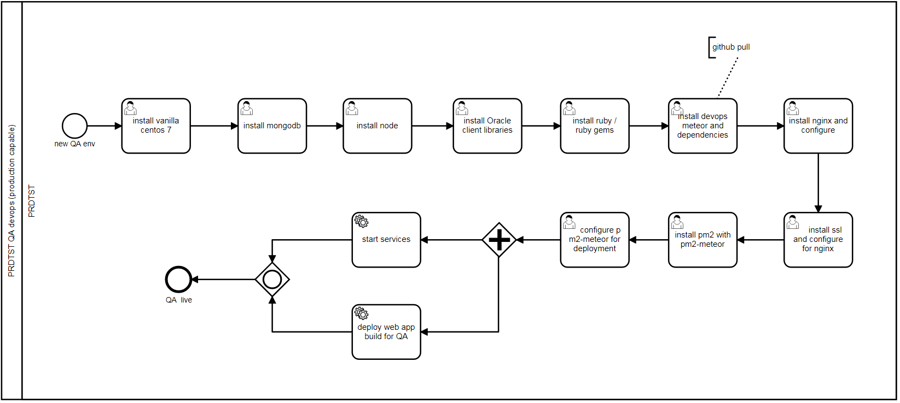
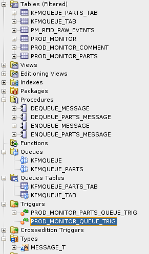
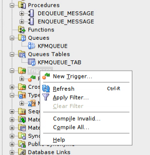
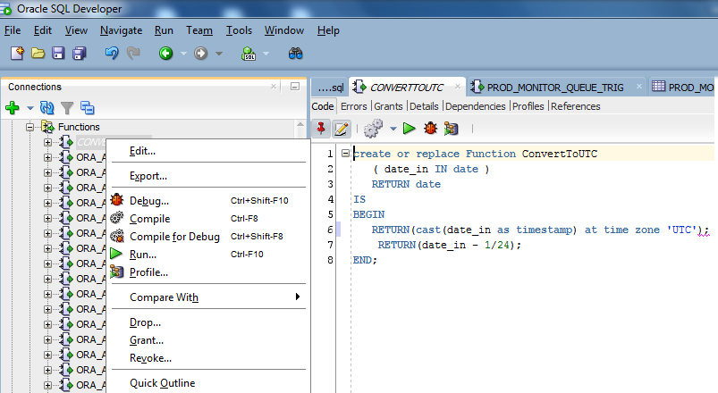
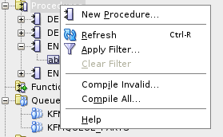
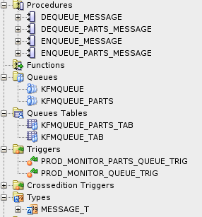

## Setup PRDTST Messaging and Queuing Environment

### Step 1 : Give HUBADMIN execute rights for AQ messaging for the consumers

As user sys as sysdba via sqlplus

SQL> grant EXECUTE on SYS.DBMS_AQ to HUBADMIN;

SQL> grant EXECUTE on DBMS_AQ to HUBADMIN;

SQL> grant EXECUTE on SYS.DBMS_AQADM to HUBADMIN;

SQL> grant EXECUTE on DBMS_AQADM to HUBADMIN;

SQL> grant EXECUTE_CATALOG_ROLE  to HUBADMIN;

Check SQL> select object_name, object_type from user_objects where object_type in ('PROCEDURE','PACKAGE', 'FUNCTION', 'PACKAGE BODY') AND ROWNUM < 50;

To make sure the HUBADMIN can see SYS available stored procedure run the above you are specifically using only the DBMS_AQ package, but the command should return package availability data limited to 50 rows (there are over 1300 stored procedures)

## Step 2 : Create Messaging Framework in Oracle for consumers

As user HUBADMIN

Create message_t message payload type for consumer(s) via sqlplus

sqlplus> create type message_t as object (json varchar(4000));

  2  /

Create the consumer queue for PROD_MONITOR messages using this message_t

sqlplus> execute DBMS_AQADM.CREATE_QUEUE_TABLE(queue_table => 'KFMQUEUE_TAB',     queue_payload_type => 'message_t' );

Create a queue for PROD_MONITOR using the above queue table.

sqlplus> execute DBMS_AQADM.CREATE_QUEUE(queue_name => 'KFMQUEUE', queue_table => 'KFMQUEUE_TAB');

Start the queue

sqlplus> execute DBMS_AQADM.START_QUEUE(queue_name => 'KFMQUEUE');

This will create the following visible entry in SQL Developer , the owner will be HUBADMIN in Oracle for PRDTST service ID

### Production Monitor Consumer

Create the procedure that will be called to enqueue and dequeue messages from the queue for PROD_MONITOR. This can be done in sqldeveloper right click on Procedures

create or replace procedure enqueue_message

(

  payload in varchar2

) as

msg message_t := message_t(NULL);

msg_id RAW(16);

priority NUMBER;

enqueue_options DBMS_AQ.ENQUEUE_OPTIONS_T;

message_properties DBMS_AQ.MESSAGE_PROPERTIES_T;

BEGIN

  msg.json := payload;

  message_properties.priority := 1;  -- give all messages same priority

  DBMS_AQ.ENQUEUE(

queue_name => 'kfmqueue',

enqueue_options => enqueue_options,

message_properties => message_properties,

payload => msg,

msgid => msg_id);

END enqueue_message;

Create the associated Procedure to dequeue a message

create or replace procedure dequeue_message

(

  payload out varchar2

) as

msg message_t := message_t(NULL); --message_t must match the message object type created in sqlplus

  msg_id RAW(16);

  dequeue_options DBMS_AQ.DEQUEUE_OPTIONS_T;

  message_properties DBMS_AQ.MESSAGE_PROPERTIES_T;

BEGIN

  DBMS_AQ.DEQUEUE(

queue_name => 'kfmqueue',

dequeue_options => dequeue_options,

message_properties => message_properties,

payload => msg,

msgid => msg_id

  ); -- the queue name must match the queue created in sqlplus

  payload := msg.json;

END dequeue_message;

Create new trigger to monitor for data changes, right click on the Trigger icon and select New Trigger

Create the PROD_MONITOR_QUEUE_TRIG as below:-

SQL> CREATE OR REPLACE TRIGGER "HUBADMIN"."PROD_MONITOR_QUEUE_TRIG" AFTER INSERT OR UPDATE OF UPDATE_DATE ON PROD_MONITOR

FOR EACH ROW

DECLARE

json VARCHAR2(4000);

BEGIN

execute immediate 'alter session set NLS_DATE_FORMAT=''yyyy-mm-dd"T"hh24:mi:ss''';

-- For simplicity sake for POC simple concatenations.  Production

-- JSON serialization code should do character escaping (double quotes,

-- newlines, etc).

IF INSERTING OR UPDATING THEN

json := '{"ID_NO":"' || :new.ID_NO;

json := json|| '","CREATE_DATE":"' || :new.CREATE_DATE;

json := json|| '","CREATE_BY":"' || :new.CREATE_BY;

json := json|| '","UPDATE_DATE":"' || :new.UPDATE_DATE;

json := json|| '","UPDATE_BY":"' || :new.UPDATE_BY;

json := json|| '","MONTHLY_SEQ":"' || :new.MONTHLY_SEQ;

json := json|| '","MODEL_CODE":"' || :new.MODEL_CODE;

json := json|| '","REMARKS":"' || :new.REMARKS;

json := json|| '","PLAN_PROD_FINISH_DATE":"' || :new.PLAN_PROD_FINISH_DATE;

json := json|| '","LOCATION_STATUS":"' || :new.LOCATION_STATUS;

json := json|| '","PARTS_PREPARATION_STATUS":"' || :new.PARTS_PREPARATION_STATUS;

json := json|| '","CHASSIS_LINE_START_DATE":"' || :new.CHASSIS_LINE_START_DATE;

json := json|| '","CHASSIS_LINE_END_DATE":"' || :new.CHASSIS_LINE_END_DATE;

json := json|| '","PAINT_LINE_START_DATE":"' || :new.PAINT_LINE_START_DATE;

json := json|| '","PAINT_LINE_END_DATE":"' || :new.PAINT_LINE_END_DATE;

json := json|| '","TRACTOR_LINE_START_DATE":"' || :new.TRACTOR_LINE_START_DATE;

json := json|| '","TRACTOR_LINE_END_DATE":"' || :new.TRACTOR_LINE_END_DATE;

json := json|| '","REWORK_BEFORE_MQ_START_DATE":"' || :new.REWORK_BEFORE_MQ_START_DATE;

json := json|| '","REWORK_BEFORE_MQ_END_DATE":"' || :new.REWORK_BEFORE_MQ_END_DATE;

json := json|| '","MQ_LINE_START_DATE":"' || :new.MQ_LINE_START_DATE;

json := json|| '","MQ_LINE_END_DATE":"'|| :new.MQ_LINE_END_DATE;

json := json|| '","REWORK_AFTER_MQ_START_DATE":"' || :new.REWORK_AFTER_MQ_START_DATE;

json := json|| '","REWORK_AFTER_MQ_END_DATE":"' || :new.REWORK_AFTER_MQ_END_DATE;

json := json|| '","PRODUCTION_END_DATE":"' || :new.PRODUCTION_END_DATE;

json := json|| '","INSPECTION_START_DATE":"' || :new.INSPECTION_START_DATE;

json := json|| '","INSPECTION_END_DATE":"' || :new.INSPECTION_END_DATE;

json := json|| '","REWORK_DUR_INSP_START_DATE":"' || :new.REWORK_DUR_INSP_START_DATE;

json := json|| '","REWORK_DUR_INSP_END_DATE":"' || :new.REWORK_DUR_INSP_END_DATE;

json := json|| '","SHIPPING_STATUS":"' || :new.SHIPPING_STATUS;

json := json|| '","SHIPPING_DATE":"' || :new.SHIPPING_DATE || '","dml_type":"';

json := json|| CASE WHEN INSERTING THEN 'I' ELSE 'U' END || '"}';

ELSE

json := '{"ID_NO":' || :old.ID_NO || ',"dml_type":"D"}';

END IF;

enqueue_message(json);

END;

/

ALTER TRIGGER "HUBADMIN"."PROD_MONITOR_QUEUE_TRIG" ENABLE;

commit;

### Missing Parts Consumer

Perform the same workflow for missing parts

Create the consumer queue for MISSING_PARTS messages using this message_t

sqlplus> execute DBMS_AQADM.CREATE_QUEUE_TABLE(queue_table => 'KFMQUEUE_PARTS_TAB',     queue_payload_type => 'message_t' );

Create a queue for PROD_MONITOR using the above queue table.

sqlplus> execute DBMS_AQADM.CREATE_QUEUE(queue_name => 'KFMQUEUE_PARTS', queue_table => 'KFMQUEUE_PARTS_TAB');

Start the queue

sqlplus> execute DBMS_AQADM.START_QUEUE(queue_name => 'KFMQUEUE_PARTS');

This will create the following visible entry in SQL Developer , the owner will be HUBADMIN in Oracle for PRDTST service ID

### Parts Consumer

Create the procedure that will be called to enqueue and dequeue messages from the queue for MISSING_PARTS. This can be done in sqldeveloper right click on Procedures

create or replace PROCEDURE "ENQUEUE_PARTS_MESSAGE" 

(

  payload in varchar2

) as

msg message_t := message_t(NULL); --message_t must match with the created message object type.

msg_id RAW(16);

priority NUMBER;

enqueue_options DBMS_AQ.ENQUEUE_OPTIONS_T;

message_properties DBMS_AQ.MESSAGE_PROPERTIES_T;

BEGIN

  msg.json := payload;

  message_properties.priority := 1;  -- give all messages same priority

  DBMS_AQ.ENQUEUE(

queue_name => 'kfmqueue_parts', -- the queue name must match with the created queue.

enqueue_options => enqueue_options,

message_properties => message_properties,

payload => msg,

msgid => msg_id);

END enqueue_parts_message;

Create the associated Procedure to dequeue a message from the parts queue

create or replace PROCEDURE "DEQUEUE_PARTS_MESSAGE" 

(

  payload out varchar2

) as

msg message_t := message_t(NULL); --message_t must match with the created message object type.

  msg_id RAW(16);

  dequeue_options DBMS_AQ.DEQUEUE_OPTIONS_T;

  message_properties DBMS_AQ.MESSAGE_PROPERTIES_T;

BEGIN

  DBMS_AQ.DEQUEUE(

queue_name => 'kfmqueue_parts', -- the queue name must match with the created queue.

dequeue_options => dequeue_options,

message_properties => message_properties,

payload => msg,

msgid => msg_id

  );

  payload := msg.json;

END dequeue_parts_message;

Create new trigger to monitor for data changes, right click on the Trigger icon and select New Trigger

Create the PROD_MONITOR_PARTS_QUEUE_TRIG as below:-

create or replace TRIGGER "HUBADMIN"."PROD_MONITOR_PARTS_QUEUE_TRIG" 

 AFTER INSERT OR UPDATE OF ID_NO,SEQ_NO ON PROD_MONITOR_PARTS

FOR EACH ROW

DECLARE

json VARCHAR2(4000);

BEGIN

execute immediate 'alter session set NLS_DATE_FORMAT=''yyyy-mm-dd"T"hh24:mi:ss''';

-- For simplicity sake For POC simple concatenations.  Production

-- JSON serialization code should do character escaping (double quotes,

-- newlines, etc).

IF INSERTING OR UPDATING THEN

json := '{"ID_NO":"' || :new.ID_NO;

json := json|| '","SEQ_NO":"' || :new.SEQ_NO;

json := json|| '","LOCATION":"' || :new.LOCATION;

json := json|| '","CALCULATED_DATE":"' || :new.CALCULATED_DATE;

json := json|| '","ITEM_NUMBER":"' || :new.ITEM_NUMBER;

json := json|| '","ITEM_DESCRIPTION":"' || :new.ITEM_DESCRIPTION;

json := json|| '","REQUIREMENT_QTY":"' || :new.REQUIREMENT_QTY;

json := json|| '","MISSING_QTY":"' || :new.MISSING_QTY;

json := json|| CASE WHEN INSERTING THEN 'I' ELSE 'U' END || '"}';

ELSE

json := '{"ID_NO":' || :old.ID_NO || ',"dml_type":"D"}';

END IF;

enqueue_parts_message(json);

END;

/

ALTER TRIGGER "HUBADMIN"."PROD_MONITOR_PARTS_QUEUE_TRIG" ENABLE;

commit;

### Step 3 : Confirm via SQLDEVELOPER triggers/messages/Procedures as expected

As HUBADMIN, check that the following now exist

 

## Consumer Scripts : Test Connectivity

The consumers scripts connect to Oracle PRDTST service using Basic Auth initially and check the triggers dispatch JSON objects for :-

on update of PROD_MONITOR.UPDATE_DATE, this is updated by the PM_RFID_RAW_EVENTS trigger and finite state logic with PROD_MONITOR.UPDATE_BY set as the scanner ID.

on insert or update if ID_NO,SEQ_NO on PROD_MONITOR_PARTS.

The ruby oci8 library object used to connect to PRDTST has a constructor param setting of:-

oc = OCI8.new('HUBADMIN', 'HUBADMIN','//172.20.84.36:1521/PRDTST')

This is found on the web portal VM in the two consumer scripts orcl_kfmqueue_consumer.rb  orcl_kfmqueue_parts_consumer.rb and orcl_kfmqueue_consumer_KFMPROD.rb  orcl_kfmqueue_parts_consumer_KFMPROD.rb for production environment

These two scripts for PRDTST have been adjusted accordingly for the KFM environment and are controlled now via systemd services

Contents of orcl_kfmqueue_consumer_KFMPROD.rb (copied to /usr/bin by root)

#!/usr/bin/env ruby

#**********************************************************************************************

#* Title       : Production Ready Consumer service (use systemctrl to start | stop | status)

#* Version     : 0.1

#* Date        : 28-Jun-2017

#* Last update : MSJ 28-June

#* Description : Added ruby logging / added mongo log to file / added Oracle log to file - linked to .service file in /etc/systemd/system

#**********************************************************************************************

# coding: utf-8

require 'oci8'

require 'mongo'

require 'yajl'

require 'logger'

log = Logger.new('/var/log/consumer.log','daily')

log.level = Logger::INFO

#reduce oci8 client logging verbosity and redirect to /var/log file

oc = OCI8.new('HUBADMIN', 'HUBADMIN','//172.20.84.38:1521/PRDTST')

log.info "Oracle connector OK"

#Reduce Mongo client verbosity and send to log file

Mongo::Logger.logger.level = Logger::FATAL

Mongo::Logger.logger = Logger.new('/var/log/consumer_mongo.log')

mongo_client =  Mongo::Client.new('mongodb://localhost:27017/production_kfm_db')

log.info "MongoDB connector OK"

mongo_db = mongo_client.database

cols = mongo_db.collection_names

col = mongo_db.collection('prod_monitor')

oc.exec("alter session set NLS_DATE_FORMAT='yyyy-mm-dd\"T\"hh24:mi:ss'")

cur = oc.parse('BEGIN dequeue_message(:p); END;')

log.info "Oracle cursor OK "

log.info cur

#bind_param(key, param, type = nil, length = nil) ⇒ Object

#:p is the param variable name expected by oci8 ruby gem

cur.bind_param(':p', nil, String, 4000)

#Bind the object returned back from Oracle as JSON simple String

while true

  # retrieve message

  cur.exec()

  json = Yajl::Parser.new

  json.inspect

  hash = json.parse(cur[':p'])

  #create a hash from the Oracle JSON object as a String binding to param called :p

  log.info hash

  hash.delete('_id')

  hash['CREATE_DATE']=DateTime.strptime(hash['CREATE_DATE'], '%Y-%m-%dT%H:%M:%S');

  hash['UPDATE_DATE']=DateTime.strptime(hash['UPDATE_DATE'], '%Y-%m-%dT%H:%M:%S');

  if hash['PLAN_PROD_FINISH_DATE']==""

    hash.delete('PLAN_PROD_FINISH_DATE')

  else

    hash['PLAN_PROD_FINISH_DATE']=DateTime.strptime(hash['PLAN_PROD_FINISH_DATE'], '%Y-%m-%dT%H:%M:%S');

  end

  hash['LOCATION_STATUS']=hash['LOCATION_STATUS'].to_i(10);

  if hash['PARTS_PREPARATION_STATUS']==""

    hash.delete('PARTS_PREPARATION_STATUS')

  else

    hash['PARTS_PREPARATION_STATUS']=hash['PARTS_PREPARATION_STATUS'].to_i(10);

  end

  if hash['CHASSIS_LINE_START_DATE']==""

    hash.delete('CHASSIS_LINE_START_DATE')

  else

    hash['CHASSIS_LINE_START_DATE']=DateTime.strptime(hash['CHASSIS_LINE_START_DATE'], '%Y-%m-%dT%H:%M:%S')

  end

  if hash['CHASSIS_LINE_END_DATE']==""

    hash.delete('CHASSIS_LINE_END_DATE')

  else

    hash['CHASSIS_LINE_END_DATE']=DateTime.strptime(hash['CHASSIS_LINE_END_DATE'], '%Y-%m-%dT%H:%M:%S');

  end

  if hash['PAINT_LINE_START_DATE']==""

    hash.delete('PAINT_LINE_START_DATE')

  else

    hash['PAINT_LINE_START_DATE']=DateTime.strptime(hash['PAINT_LINE_START_DATE'], '%Y-%m-%dT%H:%M:%S');

  end

  if hash['PAINT_LINE_END_DATE']==""

    hash.delete('PAINT_LINE_END_DATE')

  else

    hash['PAINT_LINE_END_DATE']=DateTime.strptime(hash['PAINT_LINE_END_DATE'], '%Y-%m-%dT%H:%M:%S');

  end

  if hash['TRACTOR_LINE_START_DATE']==""

    hash.delete('TRACTOR_LINE_START_DATE')

  else

    hash['TRACTOR_LINE_START_DATE']=DateTime.strptime(hash['TRACTOR_LINE_START_DATE'], '%Y-%m-%dT%H:%M:%S');

  end

  if hash['TRACTOR_LINE_END_DATE']==""

    hash.delete('TRACTOR_LINE_END_DATE')

  else

    hash['TRACTOR_LINE_END_DATE']=DateTime.strptime(hash['TRACTOR_LINE_END_DATE'], '%Y-%m-%dT%H:%M:%S');

  end

  if hash['REWORK_BEFORE_MQ_START_DATE']==""

    hash.delete('REWORK_BEFORE_MQ_START_DATE')

  else

    hash['REWORK_BEFORE_MQ_START_DATE']=DateTime.strptime(hash['REWORK_BEFORE_MQ_START_DATE'], '%Y-%m-%dT%H:%M:%S');

  end

  if hash['REWORK_BEFORE_MQ_END_DATE']==""

    hash.delete('REWORK_BEFORE_MQ_END_DATE')

  else

    hash['REWORK_BEFORE_MQ_END_DATE']=DateTime.strptime(hash['REWORK_BEFORE_MQ_END_DATE'], '%Y-%m-%dT%H:%M:%S');

  end

  if hash['MQ_LINE_START_DATE']==""

    hash.delete('MQ_LINE_START_DATE')

  else

    hash['MQ_LINE_START_DATE']=DateTime.strptime(hash['MQ_LINE_START_DATE'], '%Y-%m-%dT%H:%M:%S');

  end

  if hash['MQ_LINE_END_DATE']==""

    hash.delete('MQ_LINE_END_DATE')

  else

    hash['MQ_LINE_END_DATE']=DateTime.strptime(hash['MQ_LINE_END_DATE'], '%Y-%m-%dT%H:%M:%S');

  end

  if hash['REWORK_AFTER_MQ_START_DATE']==""

    hash.delete('REWORK_AFTER_MQ_START_DATE')

  else

    hash['REWORK_AFTER_MQ_START_DATE']=DateTime.strptime(hash['REWORK_AFTER_MQ_START_DATE'], '%Y-%m-%dT%H:%M:%S');

  end

  if hash['REWORK_AFTER_MQ_END_DATE']==""

    hash.delete('REWORK_AFTER_MQ_END_DATE')

  else

    hash['REWORK_AFTER_MQ_END_DATE']=DateTime.strptime(hash['REWORK_AFTER_MQ_END_DATE'], '%Y-%m-%dT%H:%M:%S');

  end

  if hash['PRODUCTION_END_DATE']==""

    hash.delete('PRODUCTION_END_DATE')

  else

    hash['PRODUCTION_END_DATE']=DateTime.strptime(hash['PRODUCTION_END_DATE'], '%Y-%m-%dT%H:%M:%S');

  end

  if hash['INSPECTION_START_DATE']==""

    hash.delete('INSPECTION_START_DATE')

  else

    hash['INSPECTION_START_DATE']=DateTime.strptime(hash['INSPECTION_START_DATE'], '%Y-%m-%dT%H:%M:%S');

  end

  if hash['INSPECTION_END_DATE']==""

    hash.delete('INSPECTION_END_DATE')

  else

    hash['INSPECTION_END_DATE']=DateTime.strptime(hash['INSPECTION_END_DATE'], '%Y-%m-%dT%H:%M:%S');

  end

  if hash['REWORK_DUR_INSP_START_DATE']==""

    hash.delete('REWORK_DUR_INSP_START_DATE')

  else

    hash['REWORK_DUR_INSP_START_DATE']=DateTime.strptime(hash['REWORK_DUR_INSP_START_DATE'], '%Y-%m-%dT%H:%M:%S');

  end

  if hash['REWORK_DUR_INSP_END_DATE']==""

    hash.delete('REWORK_DUR_INSP_END_DATE')

  else

    hash['REWORK_DUR_INSP_END_DATE']=DateTime.strptime(hash['REWORK_DUR_INSP_END_DATE'], '%Y-%m-%dT%H:%M:%S');

  end

  if hash['SHIPPING_STATUS']==""

    hash.delete('SHIPPING_STATUS')

  else

    hash['SHIPPING_STATUS']=hash['SHIPPING_STATUS'].to_i(10);

  end

  if hash['SHIPPING_DATE']==""

    hash.delete('SHIPPING_DATE')

  else

    hash['SHIPPING_DATE']=DateTime.strptime(hash['SHIPPING_DATE'], '%Y-%m-%dT%H:%M:%S');

  end

  logger.info hash.inspect

  if hash['dml_type'] == 'D'

    col.remove({'ID_NO' => hash['ID_NO']})

  else

    hash.delete('dml_type')

    col.update_one(

      {'ID_NO' => hash['ID_NO']},

      hash,

      {:upsert => true}

    )

  end

  # remove from AQ.  dequeue isn't complete until this happens

  oc.commit

  log.info "Oracle commit OK"

end

Contents of the systemd service Unit file /etc/systemd/system/consumer.service

[Unit]

Description=KFM PROD_MONITOR Consumer

After=syslog.target

[Service]

Type=simple

PIDFile=/var/run/kfm_consumer.pid

ExecStart=/usr/bin/bash -lc '/usr/bin/consumer.rb' --daemon --pidfile /var/run/kfm_consumer.pid

Restart=on-abort

[Install]

WantedBy=multi-user.target

systemctl enable consumer

Systemctl status consumer

systemctl stop consumer

systemctl restart consumer

All logging goes to/var/log/consumer.log and /var/log/consumer_mongo.log

-------

# Build CentOS 7 Prod Monitoring Vanilla VM

Create mongodb repository

 vi mongodb-org-3.4.repo

[mongodb-org-3.4]

name=MongoDB Repository

baseurl=https://repo.mongodb.org/yum/redhat/$releasever/mongodb-org/3.4/x86_64/

gpgcheck=1

enabled=1

gpgkey=https://www.mongodb.org/static/pgp/server-3.4.asc

yum update

=============================================================================================================

 Package                    Arch             Version                          Repository              Size

=============================================================================================================

Installing:

 kernel                    x86_64       3.10.0-514.21.1.el7                 updates                 37 M

Updating:

 NetworkManager            x86_64       1:1.4.0-20.el7_3                    updates                2.5 M

 NetworkManager-libnm      x86_64       1:1.4.0-20.el7_3                    updates                443 k

Wait for cleanup and verify stages, once Now install mongodb

yum install -y mongodb-org

Loaded plugins: fastestmirror, langpacks

Loading mirror speeds from cached hostfile

 * base: mirror.airenetworks.es

 * extras: mirror.airenetworks.es

 * updates: mirror.airenetworks.es

Resolving Dependencies

--> Running transaction check

---> Package mongodb-org.x86_64 0:3.4.5-1.el7 will be installed

--> Processing Dependency: mongodb-org-tools = 3.4.5 for package: mongodb-org-3.4.5-1.el7.x86_64

..

..

Complete!

Turn off selinux

cat /etc/selinux/config

# This file controls the state of SELinux on the system.

# SELINUX= can take one of these three values:

#     enforcing - SELinux security policy is enforced.

#     permissive - SELinux prints warnings instead of enforcing.

#     disabled - No SELinux policy is loaded.

SELINUX=enforcing

# SELINUXTYPE= can take one of three two values:

#     targeted - Targeted processes are protected,

#     minimum - Modification of targeted policy. Only selected processes are protected.

#     mls - Multi Level Security protection.

SELINUXTYPE=targeted

vi /etc/selinux/config

change SELINUX=disabled

shutdown -r now

Check mongodb service ok

systemctl start mongodb

systemctl status mongod

● mongod.service - High-performance, schema-free document-oriented database

   Loaded: loaded (/usr/lib/systemd/system/mongod.service; enabled; vendor preset: disabled)

   Active: active (running) since Thu 2017-06-15 15:53:01 CEST; 1min 13s ago

     Docs: https://docs.mongodb.org/manual

  Process: 969 ExecStartPre=/usr/bin/chmod 0755 /var/run/mongodb (code=exited, status=0/SUCCESS)

  Process: 966 ExecStartPre=/usr/bin/chown mongod:mongod /var/run/mongodb (code=exited, status=0/SUCCESS)

  Process: 960 ExecStartPre=/usr/bin/mkdir -p /var/run/mongodb (code=exited, status=0/SUCCESS)

 Main PID: 1619 (mongod)

   CGroup: /system.slice/mongod.service

           └─1619 /usr/bin/mongod --quiet -f /etc/mongod.conf run

Jun 15 15:53:01 KfmProdMonWS.kfme.fr systemd[1]: Starting High-performance, schema-free document-oriented database...

Jun 15 15:53:01 KfmProdMonWS.kfme.fr systemd[1]: Started High-performance, schema-free document-oriented database.

Jun 15 15:53:03 KfmProdMonWS.kfme.fr mongod[973]: about to fork child process, waiting until server is ready for connections.

Jun 15 15:53:03 KfmProdMonWS.kfme.fr mongod[973]: forked process: 1619

Jun 15 15:53:04 KfmProdMonWS.kfme.fr mongod[973]: child process started successfully, parent exiting

Set mongodb set to start after system restart

systemctl enable mongod.service

Install node by adding the node source repository

wget [https://rpm.nodesource.com/pub_6.x/el/7/x86_64/nodesource-release-el7-1.noarch.rpm](https://rpm.nodesource.com/pub_6.x/el/7/x86_64/nodesource-release-el7-1.noarch.rpm)

--2017-06-15 16:00:00--  

https://rpm.nodesource.com/pub_6.x/el/7/x86_64/nodesource-release-el7-1.noarch.rpm

Resolving rpm.nodesource.com (rpm.nodesource.com)... 54.230.79.15, 54.230.79.140, 54.230.79.39, ...

Connecting to rpm.nodesource.com (rpm.nodesource.com)|54.230.79.15|:443... connected.

HTTP request sent, awaiting response... 200 OK

Length: 6460 (6.3K) [application/x-rpm]

Saving to: ‘nodesource-release-el7-1.noarch.rpm’

100%[========================================================>] 6,460       --.-K/s   in 0s

2017-06-15 16:00:00 (466 MB/s) - ‘nodesource-release-el7-1.noarch.rpm’ saved [6460/6460]

Install node source via yum

yum localinstall nodesource-release-el7-1.noarch.rpm

==========================================================================================================

 Package                          Arch       Version      Repository                                Size

==========================================================================================================

Installing:

 nodesource-release               noarch               el7-1   

/nodesource-release-el7-1.noarch               3.1 k

Transaction Summary

==========================================================================================================

..

Transaction test succeeded

Installed:

  nodesource-release.noarch 0:el7-1

Complete!

Now install nodejs binaries via yum

yum install nodejs

Dependencies Resolved

============================================================================================================

 Package                Arch                   Version                     Repository                  Size

============================================================================================================

Installing:

 nodejs                 x86_64       2:6.11.0-1nodesource.el7.centos        nodesource                 9.4 M

Transaction Summary

============================================================================================================

Install  1 Package

..

Public key for nodejs-6.11.0-1nodesource.el7.centos.x86_64.rpm is not installed

nodejs-6.11.0-1nodesource.el7.centos.x86_64.rpm                                                             | 9.4 MB  00:00:03

Retrieving key from file:///etc/pki/rpm-gpg/NODESOURCE-GPG-SIGNING-KEY-EL

Importing GPG key 0x34FA74DD:

..

..

Complete!

Install the Oracle instantclient 64bit  libraries for Linux

rpm -ivf oracle-instantclient12.2-sqlplus-12.2.0.1.0-1.x86_64.rpm

rpm -ivh oracle-instantclient12.2-devel-12.2.0.1.0-1.x86_64.rpm

export LD_LIBRARY_PATH=/usr/lib/oracle/12.2/client64/lib

export OCI_LIB_DIR=/usr/lib/oracle/12.2/client64

export OCI_INC_DIR=/usr/include/oracle/12.2/client64

export ORACLE_HOME=/usr/lib/oracle/12.2

To allow the oci8 gem to be installed you will need the Development env and headers

yum group install "Development Tools"

gem install ruby-oci8 /* This is dependant on Oracle headers and instant client libraries - make sure the paths are correct as above */

gem install mongo

gem install yajl-ruby --platform=ruby

yum install -y mongodb-org

Check status of SElinux

cat /etc/selinux/config

Turn off SELinux by editing the enforcing to disabled

vi /etc/selinux/config

shutdown -r now

Log back in after restart as root user

npm install -g react-tools

curl https://install.meteor.com/ | sh

vi ~/.bashrc /* create environment for meteor - for devops MONGO_URL etc */

useradd -m prodmon

passwd prodmon

su - prodmon

Add prodmon to sudo level with visudo as root

Notes on using screen to prevent devops application stopping on ssh disconnect

prodmon$screen

Start app in devops mode

cd /home/prodmon/kfm_poc

UNIVERSE_I18N_LOCALE=en,ja,fr MONGO_URL='mongodb://localhost:27017/production_kfm_db' meteor -p 172.20.84.86:3000

The application should resolve node dependencies and start. If you have any errors about fibers - check the mongodb environment variable

Exit screen console and leave running Ctrl a+d  (to kill screen Ctrl C then type exit)

To lists all screens

prodmin$ screen -r

And reconnect

screen -r 1276.sometext

Admin seed : by default the following user is added to the vanilla application


db.users.insert(
{
    "_id" : "2SLemX9BG28pnfkq2",
    "createdAt" : ISODate("2017-06-08T00:26:03.123Z"),
    "services" : {
        "password" : {
            "bcrypt" : "$2a$10$dCtBCzerFrMC.mbVteQw3ejP04B0X63/rs7inhkThGR92Jn0eTA1m" 
        }, 
        "resume" : { 
            "loginTokens" : [ 
                { 
                    "when" : ISODate("2017-06-08T00:26:03.146Z"), 
                    "hashedToken" : "o1ufmD59kU4/6AGaQcV/H05BcM5Hm2H98JKiAA4JSj8=" 
                } 
            ] 
        } 
    }, 
    "username" : "administrator", 
    "roles" : { "__global_roles__" : [ "Admin" ] } 
}
)

## Production

### Install reverse proxy for load balancing in future

Install the epel repository

sudo yum install epel-release

sudo yum install nginx

Edit the nginx config as below:-

sudo vi /etc/nginx/nginx.conf

Replace the code block in nginx.conf 

location / {
}

with
location / {
    proxy_pass http://172.20.84.86:80;
    proxy_http_version 1.1;
    proxy_set_header Upgrade $http_upgrade;
    proxy_set_header Connection 'upgrade';
    proxy_set_header Host $host;
   proxy_cache_bypass $http_upgrade;
}

Activate the change and make sure nginx set to start on server start

## sudo systemctl restart nginx
sudo systemctl enable nginx

## 
pm2

Install the pm2 node application production deployment tool

sudo npm install pm2@latest -g

## pm2-meteor

Install the meteor deployment utility that is used to automatically deploy devops instance to a production node, in this case our production node is the localhost VM, but in future this will be the IP address of the final VM instance for production deployment

npm i -g pm2-meteor

## Setup deployment config file from within meteor

cd kfm_poc

$ pm2-meteor init

Answer the config questions

Edit the pm2-meteor.json and put the following details in the json keys

pm2-meteor.json

{

  "appName": "ProductionMonitoringSystem",

  "appLocation": {

    "local": "/home/prodmon/kfm_poc/"

  },

  "meteorSettingsLocation": "/home/prodmon/kfm_poc/settings.json",

  "meteorSettingsInRepo": false,

  "prebuildScript": "",

  "meteorBuildFlags": "--architecture os.linux.x86_64",

  "env": {

    "ROOT_URL": "http://172.20.84.86",

    "PORT": "8080",

    "MONGO_URL": "mongodb://localhost:27017/production_kfm_db"

  },

  "server": {

    "host": "localhost",

    "username": "prodmon",

    "password": "nec2017",

    "deploymentDir": "/home/prodmon/meteor-apps",

    "loadProfile": "",

    "nvm": {

      "bin": "",

      "use": ""

    },

    "exec_mode": "cluster_mode",

    "instances": 1

  }

}

pm2 start pm2-env.json

pm2 list

┌────────────────────────────┬────┬─────────┬───────┬────────┬─────────┬────────┬─────┬────────────┬──────────┐

│ App name                   │ id │ mode    │ pid   │ status │ restart │ uptime │ cpu │ mem        │ watching │

├────────────────────────────┼────┼─────────┼───────┼────────┼─────────┼────────┼─────┼────────────┼──────────┤

│ ProductionMonitoringSystem │ 0  │ cluster │ 31293 │ online │ 0       │ 44h    │ 0%  │ 106.3 MB   │ disabled │

└────────────────────────────┴────┴─────────┴───────┴────────┴─────────┴────────┴─────┴────────────┴──────────┘

Use `pm2 show <id|name>` to get more details about an app

pm2 show 0

 Describing process with id 0 - name ProductionMonitoringSystem

┌───────────────────┬─────────────────────────────────────────────────────────────────────┐

│ status            │ online                                                              │

│ name              │ ProductionMonitoringSystem                                          │

│ restarts          │ 0                                                                   │

│ uptime            │ 44h                                                                 │

│ script path       │ /home/prodmon/meteor-apps/ProductionMonitoringSystem/bundle/main.js │

│ script args       │ N/A                                                                 │

│ error log path    │ /home/prodmon/.pm2/logs/ProductionMonitoringSystem-error-0.log      │

│ out log path      │ /home/prodmon/.pm2/logs/ProductionMonitoringSystem-out-0.log        │

│ pid path          │ /home/prodmon/.pm2/pids/ProductionMonitoringSystem-0.pid            │

│ interpreter       │ node                                                                │

│ interpreter args  │ N/A                                                                 │

│ script id         │ 0                                                                   │

│ exec cwd          │ /home/prodmon/meteor-apps/ProductionMonitoringSystem                │

│ exec mode         │ cluster_mode                                                        │

│ node.js version   │ 6.11.0                                                              │

│ watch & reload    │ ✘                                                                   │

│ unstable restarts │ 0                                                                   │

│ created at        │ 2017-06-28T16:24:56.102Z                                            │

└───────────────────┴─────────────────────────────────────────────────────────────────────┘

 Code metrics value

┌────────────┬────────┐

│ Loop delay │ 1.21ms │

└────────────┴────────┘

 Add your own code metrics: http://bit.ly/code-metrics

 Use `pm2 logs ProductionMonitoringSystem [--lines 1000]` to display logs

 Use `pm2 monit` to monitor CPU and Memory usage ProductionMonitoringSystem

To enable change watching 

pm2 stop ProductionMonitoringSystem

pm2 start ProductionMonitoringSystem --watch

pm2 startup systemd

pm2 list

pm2 save

pm2 startup systemd

If you run startup systemd as sudo you  may need to run

sudo env PATH=$PATH:/usr/bin /usr/lib/node_modules/pm2/bin/pm2 startup systemd -u prodmon --hp /home/prodmon

### Deploy / Re-deploy

While in the devops _deployment directory to deploy your app

$ pm2-meteor deploy

If you already have deployed ProductionMonitoringSystem before, the old app tar-bundle will be moved to a ./backup directory. If you want to only reconfigure settings / env changes

$ pm2-meteor reconfig

Will send new pm2-env file to server and hard-restart your app. If something goes wrong during deploy: revert to previous version

$ pm2-meteor revert

Will unzip the old bundle.tar.gz and restart the app

### Devops to Production control

As well as using the pm2 commend directory from the _deployment devops areas (../kfm_poc) use the pm2-meteor command to control the system pm2 command for the prodmon app

$ pm2-meteor start

$ pm2-meteor stop

$ pm2-meteor status

$ pm2-meteor logs

### Production scaling the app

Start 2 more instances:

$ pm2-meteor scale +2

Down/Upgrade to 4 instances

$ pm2-meteor scale 4

CentOS systemd Settings

/etc/systemd/system/consumer.service

[Unit]

Description=KFM PROD_MONITOR Consumer

After=syslog.target

[Service]

Type=simple

PIDFile=/var/run/kfm_consumer.pid

ExecStart=/usr/bin/bash -lc '/usr/bin/consumer.rb' --daemon --pidfile /var/run/kfm_consumer.pid

Restart=always

RestartSec=60

[Install]

WantedBy=multi-user.target

/etc/systemd/system/consumerp.service

[Unit]

Description=KFM PROD_MONITOR_PARTS Consumer

After=syslog.target

[Service]

Type=simple

PIDFile=/var/run/kfm_consumer_parts.pid

ExecStart=/usr/bin/bash -lc '/usr/bin/consumerp.rb' --daemon --pidfile /var/run/kfm_consumer_parts.pid

Restart=always

RestartSec=60

[Install]

WantedBy=multi-user.target

Check consumer services running status

# systemctl start consumer

# systemctl status consumer

● consumer.service - KFM PROD_MONITOR Consumer

   Loaded: loaded (/etc/systemd/system/consumer.service; enabled; vendor preset: disabled)

   Active: active (running) since Fri 2017-06-30 16:25:38 CEST; 1s ago

 Main PID: 3004 (ruby)

   CGroup: /system.slice/consumer.service

           └─3004 ruby /usr/bin/consumer.rb

Jun 30 16:25:38 KfmProdMonWS.kfme.fr systemd[1]: Started KFM PROD_MONITOR Consumer.

Jun 30 16:25:38 KfmProdMonWS.kfme.fr systemd[1]: Starting KFM PROD_MONITOR Consumer...

Jun 30 16:25:39 KfmProdMonWS.kfme.fr bash[3004]: Warning: NLS_LANG is not set. fallback to US7ASCII.

# systemctl start consumerp

# systemctl status consumerp

● consumerp.service - KFM PROD_MONITOR_PARTS Consumer

   Loaded: loaded (/etc/systemd/system/consumerp.service; enabled; vendor preset: disabled)

   Active: active (running) since Fri 2017-06-30 16:25:49 CEST; 2s ago

 Main PID: 3029 (ruby)

   CGroup: /system.slice/consumerp.service

           └─3029 ruby /usr/bin/consumerp.rb

Jun 30 16:25:49 KfmProdMonWS.kfme.fr systemd[1]: Started KFM PROD_MONITOR_PARTS Consumer.

Jun 30 16:25:49 KfmProdMonWS.kfme.fr systemd[1]: Starting KFM PROD_MONITOR_PARTS Consumer...

Jun 30 16:25:49 KfmProdMonWS.kfme.fr bash[3029]: Warning: NLS_LANG is not set. fallback to US7ASCII.

